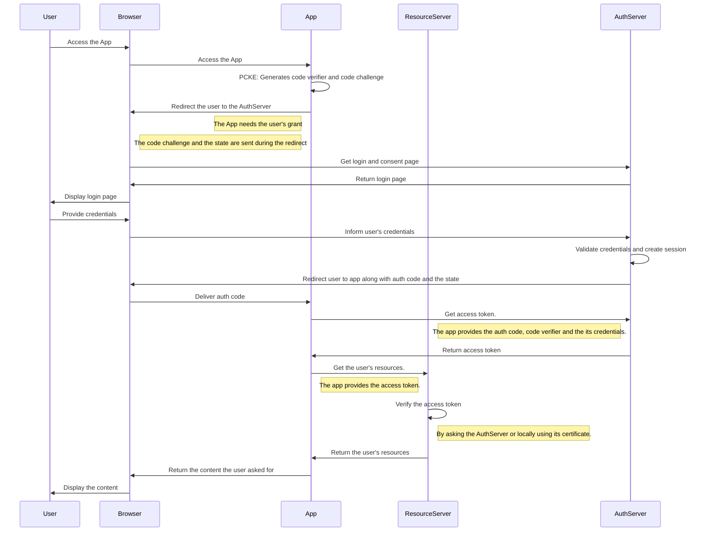

# OAuth 2.1 Server
In this project we'll build an OAuth environment based on the OAuth 2.1 framework.

## API Documentation

To access the OpenAPI specification with swagger go to:
http://localhost:8080/swagger-ui.html

## Overview

Some important and interesting concepts surronding OAuth.

### Authorization Grant Flow
In the general scenario, for a private client (the client can stored secrets securely), what happens is the following: A user wants to access an app (client) through his browser (user agent). The app in turn uses the user's resources to perform its activities.

However the user's resources are stored in the ResourceServer. In order to the App access the user's resources, it needs to ask the user to allow it. This grant flow is managed by the AuthServer.

Here below we can see how the flow happens

Sequence diagram built using [Mermaid.js](https://mermaid.js.org/)

### OpenID Connect (OIDC)
The OAuth framework allows users to authorize clients to be access its resources in different servers. However OAuth on its own does not allow the clients to know who the users are. Then, if the client wants to know his user, it needs to use OpenID Connect.

OpenID Connect is an extension of the OAuth framework that allows clients to get information about the user by providing another type of token namely id token. Other than that some other endpoints may be implemented such as `/user_info`.

To get an id token you just have to add the scope `openid` (and other ones if you need, e.g. `email`, `profile`, ...) during the authorization request to the Authorization Server.

### CSRF Attack and the state parameter
The OAuth framework allows us to restore the state in which the user left the client before he was redirected to the authorization server. This happens because the authorization server redirects the logged user back to the client passing two parameters in the callback url registered by the client itself. The first is the authorization code and the second the state parameter.

The state parameter could be, for instance, the path to the exact page in the client app that the user was visiting before trying to authorize the client to access its resources in the Resource server. However, the state parameter has another important utility which is to prevent CSRF attacks in the client. This is done by adding a non guessable value to the state and verifing that the state sent to the authorization server is the same that comes back in the callback url.

[Here is a more detailed explanation about the state parameter and how CSRF works.](https://auth0.com/docs/secure/attack-protection/state-parameters)

[And here you can find an example of how CSRF happens without the state parameter.](https://stackoverflow.com/questions/35985551/how-does-csrf-work-without-state-parameter-in-oauth2-0)
