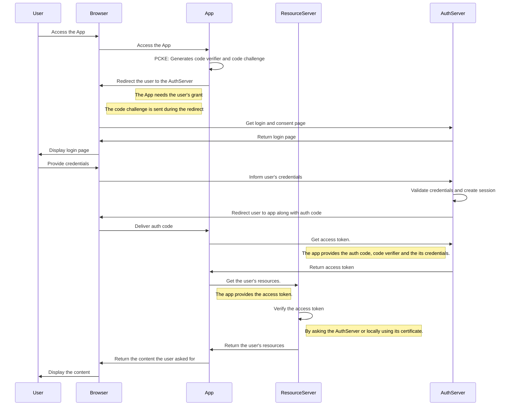

# oauth2-env
In this project we'll build an OAuth environment based on the OAuth 2.1 framework.

## Authorization Grant Flow
In the general scenario, for a private client (the client can stored secrets securely), what happens is the following: A user wants to access an app (client) through his browser (user agent). The app in turn uses the user's resources to perform its activities.

However the user's resources are stored in the ResourceServer. In order to the App access the user's resources, it needs to ask the user to allow it. This grant flow is managed by the AuthServer.

Here below we can see how the flow happens

Sequence diagram built using [Mermaid.js](https://mermaid.js.org/)

## API

To access the OpenAPI specification with swagger go to:
http://localhost:8080/swagger-ui.html